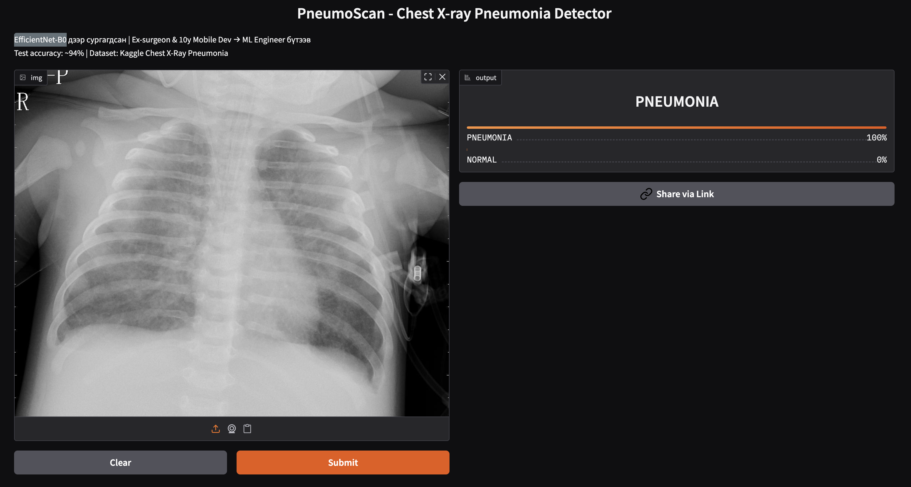

# PneumoScan: Pneumonia Detection from Chest X-Rays (v1 – Baseline)

🩻 **Built by an Ex-Surgeon turned ML Engineer**  
A simple yet powerful deep learning model for detecting pneumonia from chest X-ray images.

  
*Left: Normal lungs | Right: Pneumonia with consolidation (source: educational medical video)*

### Project Overview

This is the **first version (baseline)** of PneumoScan – a binary classification model that distinguishes **NORMAL** from **PNEUMONIA** in chest X-rays.

- Dataset: Kaggle Chest X-Ray Images (Pneumonia) – ~5,863 images
- Model: Pretrained **EfficientNet-B0** (transfer learning)
- Achieved **Test Accuracy: 94.71%** on hold-out test set
- Precision/Recall/F1 strong for pneumonia class (critical for clinical use)

As a former **surgeon** (with experience in thoracic cases), 10+ years mobile developer (Android/iOS), and self-taught ML engineer (TensorFlow Certified), I built this to create clinically relevant AI tools.

### Key Results

- **Test Accuracy**: 0.9471 (94.71%)
- **Classification Report**:

## Demo

Try it live!  
  
  

